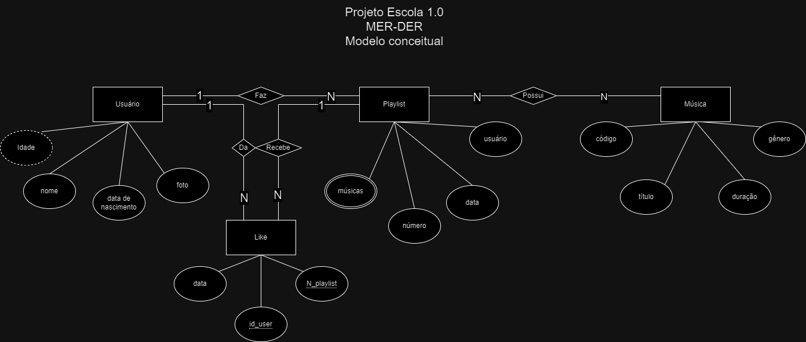

# Rede Social de Música
## Diagrama

## Dicionário de Dados

| Entidade     | Atributo    |    Descrição|                                                   
|-|-|-|
| **Usuário**  | Nome| Identificação do usuário|
| **Usuário**         | Idade  | Observações sobre o usuário    |                                    
| **Usuário**                  | Foto | Identificação do usuário|
|**Usuário** |Data de Nascimento | Identificação do usuário|
| **Playlist**  | Número | Identificador único da playlist|
| **Playlist**              | Usuário| Quem criou a playlist|
| **Playlist**              | Data | Quando foi criada|
| **Playlist**              | Músicas | Quais estão presentes na playlist|
| **Música** | Código| Identificador da playlist|
| **Música**           | Título| Nome da música|
| **Música**           |Duração| Duração da música|
| **Like** | Data| Quando foi deixado o like|
| **Like**           | Número da Playlist| Identificação da playlist|
| **Like**           |Id_user| Identificação do usuário|
 
***Produzido por Beatriz e Laila***